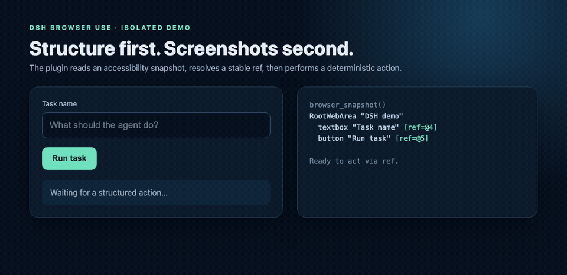
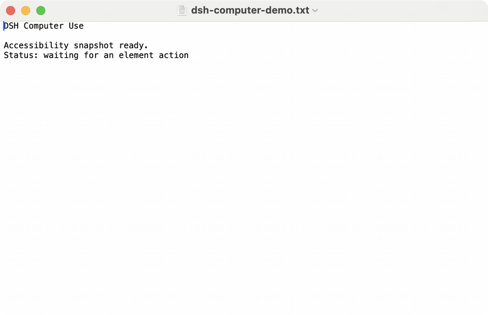
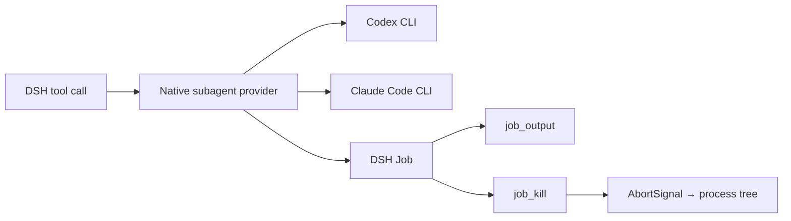
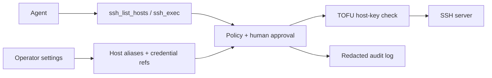

<div align="center">

# DSH Plugins

### Operate browsers, desktops, subagents, and remote servers—with guardrails.

[English](README.md) · [简体中文](README.zh-CN.md)

[](LICENSE)
[](https://nodejs.org/)
[](https://github.com/DjangoAILab/dsh-plugins/releases)
[](https://github.com/DjangoAILab/dsh-plugins/commits/main)

Open-source extensions and field-tested engineering notes for
[DeepSeek Harness](https://github.com/deepseek-ai/deepseek-harness).

</div>

## Four things worth seeing

### 1. Browser Use — operate the DOM, not a pile of pixels

Connect to a dedicated Chrome profile over CDP, observe the page as a compact accessibility tree, address elements
with stable refs, and fall back to screenshots only when structure is not enough. The plugin includes navigation,
tabs, forms, dialogs, uploads, console/network inspection, masked cookies, persistent sessions, and an optional
fail-closed approval gate.



The demo above is real: the plugin's CDP client and action primitives drive an isolated local page. No account,
browser history, or production endpoint is present. [Open the Browser Use module →](plugins/manual/dsh-browser-control/README.md)

### 2. Computer Use — native macOS control through Accessibility

Turn macOS applications into an element-level tool surface through `AXUIElement`: inspect apps and windows, snapshot
the accessibility tree, then click, type, press keys, use menus, scroll, launch, activate, or quit. A Swift helper
runs behind a bounded JSON-lines protocol; missing permissions and unsupported platforms fail closed.



This is a window-only capture of the actual Swift AX driver resolving and editing an isolated TextEdit document.
[Open the Computer Use module →](plugins/manual/dsh-computer-use/README.md)

### 3. Subagents — Codex and Claude Code as native DSH providers

Register external coding agents behind DSH's own subagent contract instead of inventing another scheduler. Foreground
runs, background jobs, polling, cancellation, subprocess trees, output limits, provider aliases, and sandbox profiles
remain explicit and deployment-controlled.



[Open the External Agents module →](plugins/manual/dsh-external-agents/README.md)

### 4. SSH Operations — manage servers without handing credentials to the model

Register remote hosts behind memorable aliases, then let the agent list those aliases and execute one bounded command
at a time. Hostnames, usernames, private keys, login passwords, and sudo passwords stay behind the plugin boundary.
TOFU host-key pinning, per-command approval, a separate elevation approval, and redacted JSONL audit records make the
control path inspectable.



Sudo uses a two-step, fail-closed protocol: try passwordless execution first, and inject a stored sudo password only
when the remote host proves it is required. The current release intentionally has no interactive PTY, upload, or
download surface. [Open the SSH Operations module →](plugins/manual/ops-ssh-manager/README.md)

## Why it is built this way

- **Structure first.** DOM and accessibility trees are cheaper, more inspectable, and more deterministic than
  screenshot-only control. Screenshots remain a deliberate fallback.
- **Native lifecycle.** Plugins reuse DSH providers, Jobs, cancellation signals, and subprocess ownership.
- **Least privilege by default.** Sensitive actions can require human approval; external agents keep a sandbox unless
  the deployer deliberately selects a different profile. SSH elevation has its own approval boundary.
- **Reversible modules.** Every module documents what changed, how it takes effect, and how to roll it back.

## Start here

```bash
git clone https://github.com/DjangoAILab/dsh-plugins.git
cd dsh-plugins
```

Choose one of the four modules above and follow its pinned install, verification, and rollback instructions. This
repository intentionally treats its directory tree as the complete index:

```bash
ls plugins/manual
ls plugins/community
ls knowledge/foundations knowledge/domains knowledge/runbooks
```

- `plugins/manual/` contains source maintained in this repository.
- `plugins/community/` contains integration recipes for upstream packages; third-party source is not vendored there.
- `knowledge/` contains reusable DSH facts, domain research, and operational runbooks.

## Updates, credit, and scope

- See [Releases](https://github.com/DjangoAILab/dsh-plugins/releases) for publishable milestones and
  [CHANGELOG.md](CHANGELOG.md) for the dated project history.
- See [ACKNOWLEDGEMENTS.md](ACKNOWLEDGEMENTS.md) for derived works, community integrations, and design references.
  Attribution is explicit; a reference does not imply affiliation or endorsement.
- This is a curated public snapshot, not a mirror of any private deployment repository. Secrets, private history,
  production configuration, and internal screenshots do not belong here.

## License

Repository-original work is available under the [MIT License](LICENSE). Vendored or adapted modules retain their
upstream notices and licenses; consult the module-local license and [acknowledgements](ACKNOWLEDGEMENTS.md).
