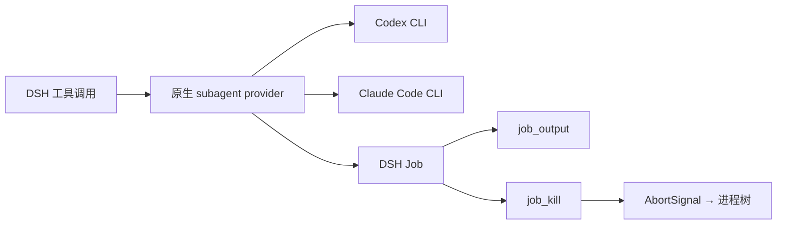
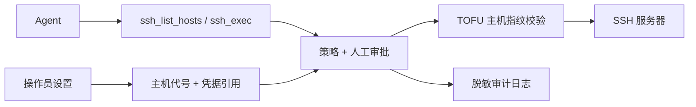

<div align="center">

# DSH Plugins

### 让 DeepSeek Harness 在护栏内操作浏览器、桌面、Subagent 与远程服务器。

[English](README.md) · [简体中文](README.zh-CN.md)

[](LICENSE)
[](https://nodejs.org/)
[](https://github.com/DjangoAILab/dsh-plugins/releases)
[](https://github.com/DjangoAILab/dsh-plugins/commits/main)

面向 [DeepSeek Harness](https://github.com/deepseek-ai/deepseek-harness) 的开源扩展与实测工程知识库。

</div>

## 四个最值得看的能力

### 1. Browser Use —— 操作 DOM，而不是盯着一堆像素猜

通过 CDP 连接独立 Chrome profile，把页面观察成紧凑的辅助功能树，用稳定 ref 寻址元素；只有结构不足
时才退回截图。插件覆盖导航、Tab、表单、对话框、上传、console/network 观测、Cookie 脱敏、持久会话，
并可为敏感动作开启 fail-closed 人工审批。


这不是产品截图拼图：演示由插件自己的 CDP client 和动作原语驱动隔离的本地页面，不包含账号、浏览记录
或生产端点。[查看 Browser Use 模块 →](plugins/manual/dsh-browser-control/README.md)

### 2. Computer Use —— 通过 Accessibility 原生控制 macOS

借助 `AXUIElement` 把 macOS 应用变成元素级工具面：枚举应用和窗口、读取辅助功能树，再点击、输入、按键、
操作菜单、滚动、启动、激活或退出。Swift helper 使用有界 JSON-lines 协议；缺权限或平台不支持时直接
fail closed。


这是实际 Swift AX driver 定位并编辑隔离 TextEdit 文档的窗口级录制，未捕获桌面其他内容。
[查看 Computer Use 模块 →](plugins/manual/dsh-computer-use/README.md)

### 3. Subagent —— 把 Codex 与 Claude Code 接成 DSH 原生 provider

把外部 coding agent 注册到 DSH 自身的 subagent 契约，不另造一套调度器。前台执行、后台 Job、轮询、取消、
子进程树、输出上限、provider 别名与沙箱档位都保持显式，并由部署者控制。



[查看 External Agents 模块 →](plugins/manual/dsh-external-agents/README.md)

### 4. SSH Operations —— 管服务器，但不把凭据交给模型

由操作员把远程主机登记为易记代号，Agent 只能列出代号并逐条执行有界命令。主机地址、用户名、私钥、
登录密码和 sudo 密码都留在插件边界之后。TOFU 主机指纹、逐命令审批、独立提权审批与脱敏 JSONL 审计，
让整个控制链可检查、可追溯。



sudo 使用两阶段 fail-closed 协议：先尝试免密执行，只有远端明确要求密码时才注入已保存的 sudo 密码。
当前版本刻意不开放交互式 PTY、上传或下载。[查看 SSH Operations 模块 →](plugins/manual/ops-ssh-manager/README.md)

## 为什么这样设计

- **结构优先。** DOM 与辅助功能树比纯截图更省上下文、更可检查，也更确定；截图保留为明确兜底。
- **复用原生生命周期。** 插件沿用 DSH provider、Jobs、取消信号和子进程归属。
- **默认最小权限。** 敏感动作可要求人工审批；外部 Agent 默认保留沙箱，SSH 提权另有独立审批边界。
- **模块可回滚。** 每个模块都说明改了什么、怎么生效、怎么回滚。

## 从这里开始

```bash
git clone https://github.com/DjangoAILab/dsh-plugins.git
cd dsh-plugins
```

从上面四项中选一个，按模块 README 的版本固定、验证与回滚步骤操作。仓库仍以目录树作为完整索引：

```bash
ls plugins/manual
ls plugins/community
ls knowledge/foundations knowledge/domains knowledge/runbooks
```

- `plugins/manual/`：source of truth 由本仓库维护的源码。
- `plugins/community/`：上游社区包的集成配方，不在这里 vendor 三方源码。
- `knowledge/`：可复用的 DSH 事实、领域研究与操作手册。

## 更新、致谢与边界

- 可发布里程碑见 [Releases](https://github.com/DjangoAILab/dsh-plugins/releases)，按日期的项目变化见
  [CHANGELOG.md](CHANGELOG.md)。
- 衍生代码、社区集成和设计参考统一列在 [ACKNOWLEDGEMENTS.md](ACKNOWLEDGEMENTS.md)。引用不代表关联、
  背书，也不会把别人的工作写成自己的原创。
- 本仓库是人工审阅后的公开快照，不是任何私有部署仓库的镜像；私有历史、密钥、生产配置与内部截图
  不会进入这里。

## 许可证

仓库原创部分采用 [MIT License](LICENSE)。vendor 或改造的模块继续保留各自上游版权与许可声明；请同时
阅读模块内许可证与[致谢说明](ACKNOWLEDGEMENTS.md)。
